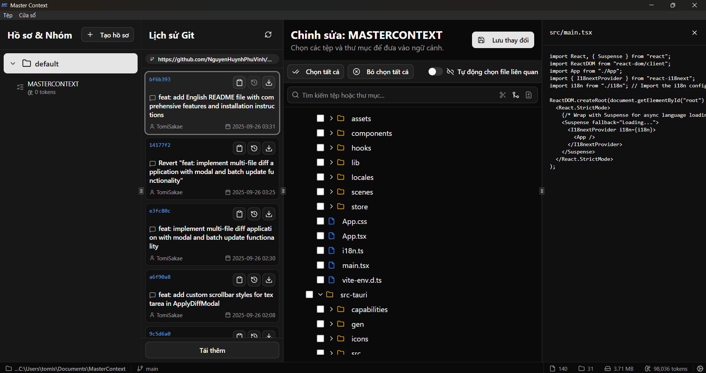

# Master Context: Trợ lý Xây dựng Ngữ cảnh Thông minh cho Lập trình viên

[](package.json)
[](https://github.com/NguyenHuynhPhuVinh/MasterContext/issues)
[](https://github.com/NguyenHuynhPhuVinh/MasterContext/stargazers)
[](https://github.com/NguyenHuynhPhuVinh/MasterContext/network/members)
[](LICENSE)
[](https://tauri.app)

**[English](./README.en.md) | Tiếng Việt**

---

**Master Context** là một ứng dụng desktop mạnh mẽ được thiết kế để cách mạng hóa quy trình làm việc của bạn với Các mô hình ngôn ngữ lớn (LLM). Thay vì sao chép thủ công tẻ nhạt, ứng dụng này giúp bạn quét thông minh, chọn lựa và tạo ra các tệp ngữ cảnh được tổ chức từ mã nguồn dự án của mình, đẩy nhanh tốc độ phát triển và đảm bảo đầu ra AI chất lượng cao.

 <!-- Cần thay thế bằng ảnh chụp màn hình thực tế của ứng dụng -->

## Tại sao lại là Master Context?

Trong kỷ nguyên của AI tạo sinh, việc cung cấp ngữ cảnh đầy đủ và chính xác về một dự án là chìa khóa để nhận kết quả chất lượng. Tuy nhiên, việc thủ công chọn lọc và sao chép nội dung từ hàng chục, hoặc thậm chí hàng trăm, tệp là một quá trình tốn thời gian, dễ mắc lỗi và bỏ sót.

**Master Context** giải quyết triệt để vấn đề này bằng cách cung cấp một bộ công cụ toàn diện và tự động, biến việc tạo ngữ cảnh từ gánh nặng thành lợi thế chiến lược.

## 🚀 Tính năng Chính

Master Context được trang bị một loạt các tính năng mạnh mẽ được thiết kế để đáp ứng nhu cầu của các lập trình viên hiện đại.

### 1. Tích hợp Git Sâu

- **Lịch sử Commit Trực quan:** Xem toàn bộ lịch sử commit của dự án ngay trong ứng dụng, với thông tin chi tiết về tác giả, ngày tháng và thông điệp.
- **Tạo Ngữ cảnh/Diff từ Commit:** Xuất toàn bộ ngữ cảnh của các tệp đã thay đổi trong một commit hoặc chỉ tệp `.diff` để xem xét mã hoặc hỏi AI về các thay đổi cụ thể.
- **Checkout Trạng thái:** Quay về trạng thái của bất kỳ commit nào để kiểm tra mã tại một thời điểm trong quá khứ (Detached HEAD).
- **Hiển thị Trạng thái Tệp:** Cây thư mục đánh dấu rõ ràng các tệp đã sửa đổi (`M`), mới thêm (`A`) hoặc đã xóa (`D`) so với commit gần nhất.
- **Clone & Mở:** Dán URL kho Git vào màn hình chào mừng để clone và bắt đầu làm việc ngay lập tức.

### 2. Trình xem và Vá lỗi Tệp Tích hợp

- **Xem Nội dung Nhanh:** Nhấp vào bất kỳ tệp nào để xem nội dung của nó trong panel riêng biệt mà không rời khỏi ứng dụng.
- **Áp dụng Diff/Patch:** Dán nội dung của tệp vá lỗi (`.diff`, `.patch`) vào ứng dụng để xem trước cách thay đổi sẽ được áp dụng lên tệp gốc.
- **Loại trừ Mã Nguồn:** Dễ dàng đánh dấu và loại trừ các đoạn mã không mong muốn khỏi ngữ cảnh mà không chỉnh sửa tệp gốc.
- **Lưu Thay đổi:** Sau khi xem trước, bạn có thể chọn áp dụng vĩnh viễn các thay đổi từ tệp vá lỗi lên tệp gốc trên đĩa.

### 3. Quản lý và Phân tích Dự án Thông minh

- **Quét Song song Hiệu suất Cao:** Tận dụng toàn bộ sức mạnh của CPU đa lõi để quét và phân tích dự án với tốc độ vượt trội.
- **Quét lại Siêu Tốc (Quét Thông minh):** Sử dụng caching siêu dữ liệu (dựa trên thời gian sửa đổi và kích thước tệp) để xử lý chỉ các tệp đã thay đổi, làm cho việc quét lại gần như tức thời.
- **Tôn trọng `.gitignore`:** Tự động bỏ qua các tệp và thư mục được định nghĩa trong tệp `.gitignore` của dự án.
- **Bộ lọc Loại trừ Tùy chỉnh:** Cho phép định nghĩa các mẫu glob (ví dụ: `dist/`, `*.log`, `node_modules/`) để loại trừ thêm các tệp không mong muốn trên toàn bộ dự án.
- **Bỏ qua Phân tích Nội dung:** Tùy chỉnh loại tệp (ví dụ: `.png`, `.lock`, `.svg`) để quét chỉ siêu dữ liệu mà không đọc nội dung, tăng tốc đáng kể việc quét cho các dự án lớn.

### 4. Kiểm soát Ngữ cảnh Chi tiết

- **Hồ sơ:** Tạo không gian làm việc độc lập trong cùng một dự án. Mỗi hồ sơ có bộ nhóm, cài đặt và cấu hình riêng, lý tưởng để tách biệt các luồng công việc khác nhau (ví dụ: "Nhiệm vụ Frontend," "Refactor Backend," "Di chuyển Cơ sở Dữ liệu").
- **Nhóm Ngữ cảnh:** Tổ chức tệp và thư mục thành các nhóm logic cho nhiệm vụ cụ thể. Dễ dàng quản lý, chỉnh sửa và theo dõi các nhóm này.
- **Thống kê Chi tiết:** Mỗi nhóm và toàn bộ dự án cung cấp thống kê trực quan về tổng số tệp, thư mục, kích thước và **ước tính số token**, giúp kiểm soát chi phí và đầu vào cho LLM.
- **Ngân sách Token:** Đặt giới hạn token cho mỗi nhóm và nhận cảnh báo trực quan khi vượt quá, đảm bảo ngữ cảnh luôn trong giới hạn của mô hình.

### 5. Phân tích Phụ thuộc và Tự động hóa

- **Phân tích Liên kết Mã Nguồn:** Tự động phân tích câu lệnh `import`, `export` và `require` để xác định phụ thuộc giữa các tệp.
- **Hỗ trợ Alias Đường dẫn:** Đọc và phân giải alias đường dẫn từ `tsconfig.json` hoặc `jsconfig.json` (ví dụ: `@/*`, `~/*`), hiểu cấu trúc dự án hiện đại.
- **Đồng bộ Chéo:** Khi kích hoạt cho một nhóm, tính năng này tự động tìm và thêm tệp phụ thuộc vào nhóm mỗi lần quét lại dự án, đảm bảo ngữ cảnh luôn đầy đủ.

### 6. Xuất Năng động và Linh hoạt

- **Sao chép vào Clipboard:** Sao chép nhanh ngữ cảnh của nhóm hoặc toàn bộ dự án vào clipboard chỉ bằng một cú nhấp.
- **Tùy chọn Cây Thư mục:** Chọn xuất ngữ cảnh với cây thư mục tối thiểu (chứa chỉ tệp đã chọn) hoặc cây thư mục dự án đầy đủ.
- **Tùy chỉnh Nội dung:**
  - **Thêm Số Dòng:** Tự động thêm số dòng vào đầu mỗi dòng mã.
  - **Loại bỏ Bình luận:** Giảm thiểu số token bằng cách tự động loại bỏ khối bình luận (`//`, `/* */`, `#`, `<!-- -->`).
  - **Loại bỏ Nhật ký Gỡ lỗi:** Tự động loại bỏ câu lệnh gỡ lỗi như `console.log`, `dbg!`, `println!`.
  - **Xuất Nén Super:** Nén toàn bộ nội dung tệp thành một dòng bên cạnh tên của nó trong cây thư mục—lý tưởng cho việc xem xét tổng quan nhanh.
- **Loại trừ Tệp theo Phần mở rộng:** Dễ dàng loại bỏ loại tệp không mong muốn (ví dụ: `.png`, `.svg`) khỏi tệp ngữ cảnh cuối cùng.
- **Luôn Áp dụng Văn bản:** Định nghĩa khối văn bản (ví dụ: chỉ thị, câu hỏi) sẽ được tự động nối vào mỗi tệp ngữ cảnh xuất.

### 7. Tối ưu hóa Quy trình Làm việc

- **Theo dõi Thực tế:** Tự động quét lại dự án khi phát hiện thay đổi trong hệ thống tệp, giữ dữ liệu luôn cập nhật.
- **Đồng bộ Tự động:** Tự động xuất tệp ngữ cảnh cho các nhóm và toàn bộ dự án vào thư mục được chỉ định khi có thay đổi, cho phép tích hợp liền mạch với các công cụ khác.
- **Quản lý Dự án Gần đây:** Truy cập nhanh các dự án đã mở trước đây ngay từ màn hình chào mừng.

### 8. Trải nghiệm Người dùng Hiện đại và Linh hoạt

- **Giao diện Trực quan:** Được xây dựng với Shadcn UI và Tailwind CSS, cung cấp trải nghiệm mượt mà và thân thiện.
- **Chế độ Sáng/Tối:** Chuyển giao diện để phù hợp với môi trường làm việc của bạn.
- **Panel Linh hoạt:** Panel có thể thay đổi kích thước cho phép tùy chỉnh không gian làm việc theo ý muốn.
- **Thông báo Hệ thống:** Nhận phản hồi tức thì cho các hành động quan trọng như hoàn thành quét, sao chép thành công hoặc lỗi.

## Ngăn xếp Công nghệ

- **Frontend:**

  - **Framework**: [React](https://reactjs.org/), [TypeScript](https://www.typescriptlang.org/), [Vite](https://vitejs.dev/)
  - **Quản lý Trạng thái**: [Zustand](https://github.com/pmndrs/zustand)
  - **UI**: [Shadcn UI](https://ui.shadcn.com/), [Tailwind CSS](https://tailwindcss.com/)
  - **Thông báo**: [Tauri Notification Plugin](https://tauri.app/v1/api/js/plugins/notification/)

- **Backend (Rust)**:
  - **Framework**: [Tauri](https://tauri.app/)
  - **Quét Hệ thống Tệp**: `ignore`
  - **Theo dõi Tệp**: `notify`
  - **Phân tích Phụ thuộc**: `regex`
  - **Đếm Token**: `tiktoken-rs`
  - **Xử lý Dữ liệu**: `serde`, `serde_json`
  - **Tạo ID Dự án**: `sha2`
  - **Tích hợp Git**: `git2`
  - **Xử lý Thời gian**: `chrono`

## Cài đặt và Thiết lập

### Yêu cầu

- [Node.js](https://nodejs.org/)
- [Rust](https://www.rust-lang.org/tools/install) và Cargo

### Các bước

1. **Clone kho lưu trữ:**

   ```bash
   git clone https://github.com/NguyenHuynhPhuVinh/MasterContext.git
   cd MasterContext
   ```

2. **Cài đặt phụ thuộc frontend:**

   ```bash
   npm install
   ```

3. **Chạy ứng dụng ở chế độ phát triển:**

   ```bash
   npm run tauri dev
   ```

4. **Xây dựng ứng dụng:**
   ```bash
   npm run tauri build
   ```

## Giấy phép

Dự án này được cấp phép theo [Giấy phép MIT](LICENSE).

## 🤝 Đóng góp

Chúng tôi hoan nghênh đóng góp! Nếu bạn muốn đóng góp cho dự án này:

1. Fork kho lưu trữ
2. Tạo nhánh tính năng của bạn (`git checkout -b feature/TinhNangTuyetVoi`)
3. Commit thay đổi của bạn (`git commit -m 'Thêm một số TinhNangTuyetVoi'`)
4. Push lên nhánh (`git push origin feature/TinhNangTuyetVoi`)
5. Mở Pull Request

## 💬 Hỗ trợ

Nếu bạn gặp vấn đề hoặc có câu hỏi:

- Mở [Issue](https://github.com/NguyenHuynhPhuVinh/MasterContext/issues) trên GitHub
- Kiểm tra tài liệu hoặc liên hệ qua các kênh hỗ trợ khác